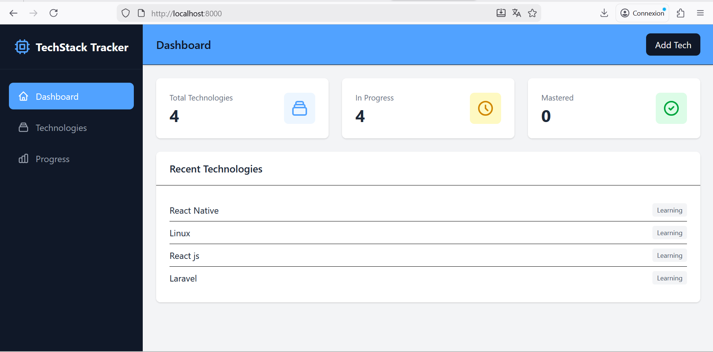

## techstack-tracker

Web application to documente techs I've to learn or master

### Tech Stack
- Laravel
- Tailwind CSS
- Vite

### Installation

```bash
git clone https://github.com/alphonsekazadi/techstack-tracker.git
cd techstack-tracker
composer install
cp .env.example .env
php artisan key:generate
php artisan migrate
php artisan serve
```